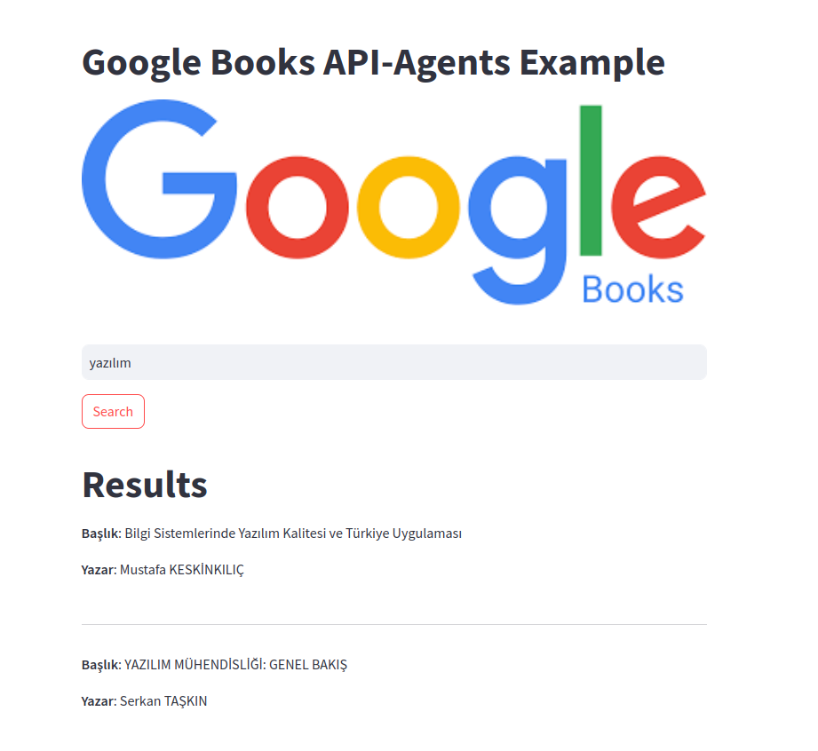

# Google Books API Agents Example




This project demonstrates an application that uses OpenAI and Google Books APIs to perform book searches and language detection. A simple user interface is provided using Streamlit.

## Project Overview

1. **OpenAIClient**: A client class that uses the OpenAI API to perform book searches and language detection.
2. **BookSearchAgent**: Performs book search operations.
3. **BookFilterAgent**: Detects the language of books and performs filtering operations.
4. **CoordinatorAgent**: Coordinates book search and filtering operations.
5. **Streamlit Interface**: Provides a user interface for searching books and displaying results.

## Usage

### Requirements

- Python 3.x
- `requests` library
- `streamlit` library
- `openai` library

To install the required libraries:

```bash
pip install requests streamlit openai
```
###  API Keys
```bash
openai_api_key = "sk-..."  # Add your OpenAI API key here
google_books_api = "YOUR_GOOGLE_BOOKS_API_KEY"  # Add your Google Books API key here

```
